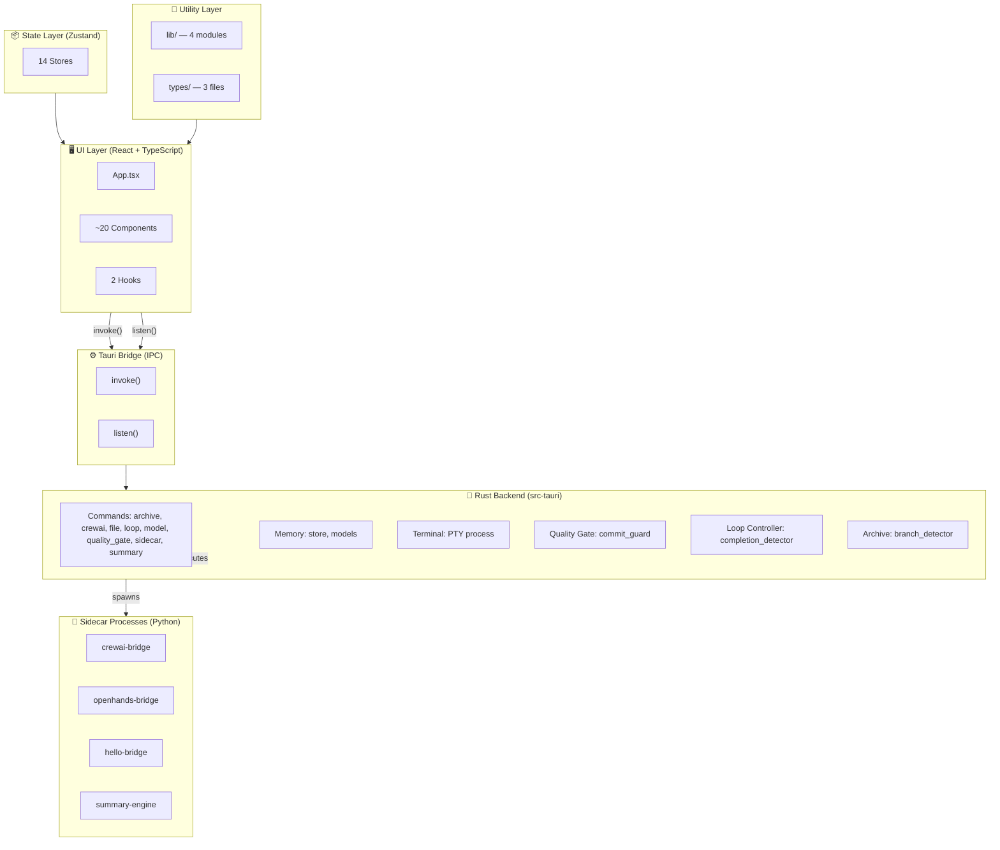
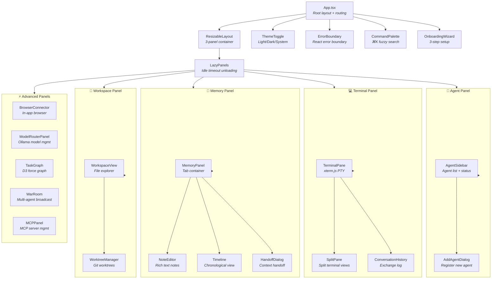
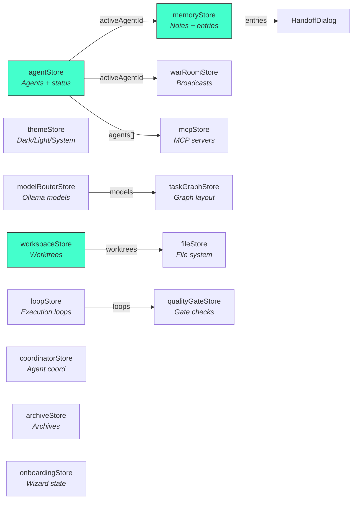
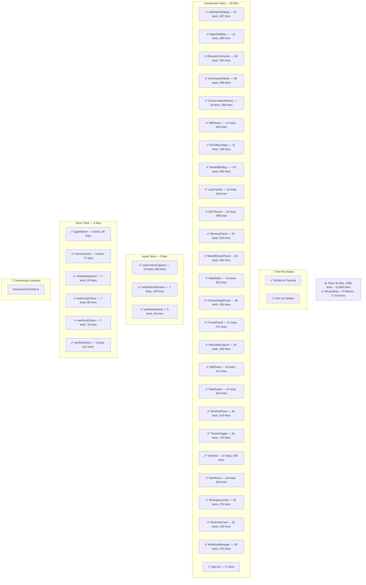
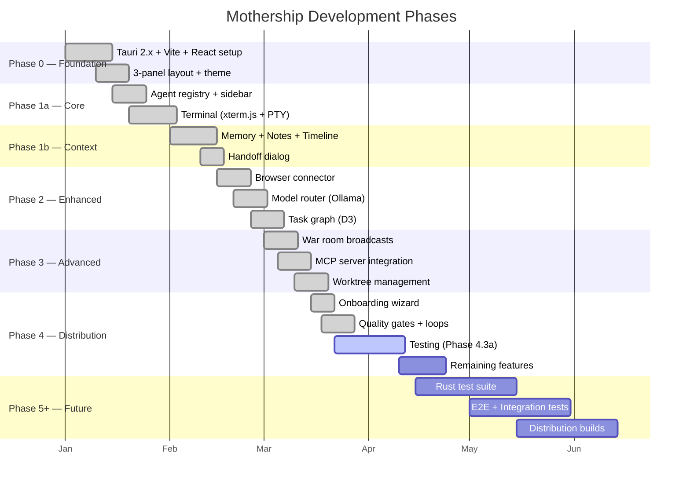
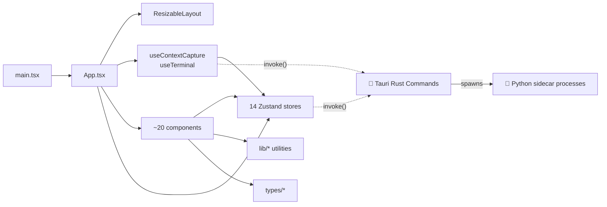
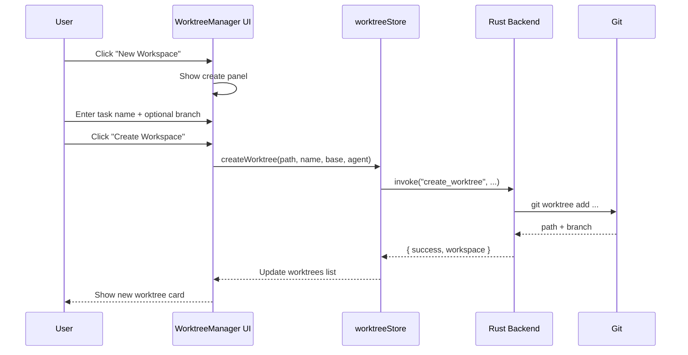
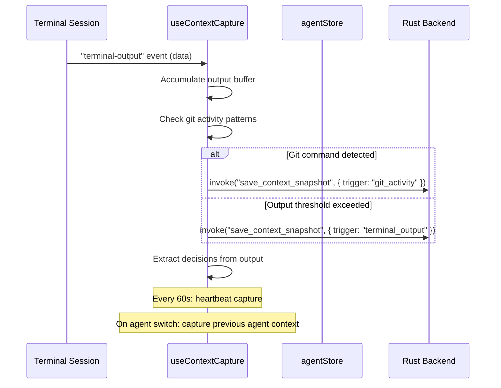

# Mothership — Project Graph

> **Update this file whenever you add, remove, or restructure a significant file, component, store, test, or phase.**
>
> To update, re-run the `src/` subtree read and adjust the Mermaid diagrams below.
> The test coverage map should reflect the latest test count from `npx vitest run --no-coverage`.

---

## 1. Architecture Layers

---

## 2. React Component Tree

---

## 3. Store Dependency Map

---

## 4. Test Coverage Map

---

## 5. Phase / Feature Roadmap

---

## 6. Source File Dependency Graph (Entry -> Imports)

---

## 7. Git Worktree Feature Flow

---

## 8. Context Capture Flow

---

## Update Checklist

When you make changes, update the relevant diagram(s):

- [ ] **New component?** → Update §2 (Component Tree) + §4 (Test Coverage)
- [ ] **New store?** → Update §3 (Store Dependency Map)
- [ ] **New test file?** → Update §4 (Test Coverage Map) with file name, test count, lines
- [ ] **New phase/feature complete?** → Update §5 (Phase Roadmap)
- [ ] **New dependency?** → Update §6 (File Dependency Graph)
- [ ] **New flow?** → Add a sequence diagram in §7+
- [ ] **Test count changed?** → Update the total in §4 note

---

**Last updated:** 2025-06-21  
**Current totals:** 40 TS test files (1008 tests) + 4 Python test files (91 tests) = 1099 total, 0 failures
